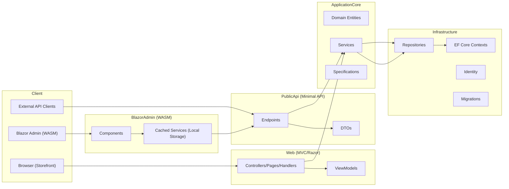

# eShopOnWeb Solution Structure and Features

## Overview
eShopOnWeb is a reference monolithic ASP.NET Core e-commerce solution that demonstrates a modular architecture with clear separation of concerns across layers and projects. The solution provides:
- A web storefront built with ASP.NET Core MVC and Razor Pages.
- A Public REST API exposing catalog and other endpoints with Swagger/OpenAPI documentation.
- A Blazor WebAssembly Admin interface for managing catalog data.
- A shared domain and application layer (ApplicationCore) and infrastructure implementations (Infrastructure).
- Comprehensive automated tests: unit, functional, and integration tests.
- Production-readiness features including Identity-based authentication, JWT authorization for API, health checks, configuration, and cloud-friendly provisioning scripts.

This document describes the solution layout, responsibilities of each project, key features, architecture and data flow, third-party libraries and services, user and admin journeys, APIs and documentation, security and health checks, test artifacts, and recommended future improvements.

## Solution Layout and Structure
At the repository root:
- eShopOnWeb.sln, Everything.sln: Solution files aggregating projects.
- src/: Application source code for each project.
- tests/: Unit, functional, and integration tests.
- infra/: Infrastructure as code (Bicep) for App Service, Key Vault, and SQL Server.
- docs/: Documentation and coverage summaries.
- docker-compose.yml and variants: Container orchestration files.
- global.json, Directory.Packages.props: SDK and package management configuration.

Key top-level solution areas:
- src/Web: ASP.NET Core MVC storefront with Razor Pages and health checks.
- src/PublicApi: Minimal API endpoints for catalog and authentication with Swagger.
- src/BlazorAdmin: Blazor WebAssembly Admin app.
- src/BlazorShared: Shared models, interfaces, and authorization constants for Blazor clients.
- src/ApplicationCore: Domain entities, specifications, and application services.
- src/Infrastructure: EF Core contexts, repositories, Identity, and logging adapters.
- tests/UnitTests: Unit tests for domain, services, and helpers.
- tests/FunctionalTests: Functional tests for MVC storefront and Public API.
- tests/IntegrationTests: Repository and persistence integration tests.
- tests/PublicApiIntegrationTests: Integration tests for PublicApi endpoints and security.

## Projects and Responsibilities

### Web (ASP.NET Core MVC storefront)
- Purpose: Customer-facing storefront to browse catalog, manage basket, and checkout.
- Notable areas and components:
  - Razor Pages and Controllers for Home, Catalog, Basket, Orders.
  - Identity UI pages under Areas/Identity for registration, login, two-factor.
  - Features/ handlers using Mediator-like patterns (e.g., GetMyOrdersHandler, GetOrderDetailsHandler).
  - ViewModels for Catalog, Basket, and Orders (e.g., CatalogIndexViewModel, OrderViewModel).
  - Services for mapping domain models to ViewModels (e.g., BasketViewModelService, ICatalogItemViewModelService).
  - Health checks (HomePageHealthCheck) for application liveness.
- Example files:
  - src/Web/Features/MyOrders/GetMyOrdersHandler.cs
  - src/Web/Features/OrderDetails/GetOrderDetailsHandler.cs
  - src/Web/Services/BasketViewModelService.cs
  - src/Web/ViewModels/CatalogIndexViewModel.cs
  - src/Web/HealthChecks/HomePageHealthCheck.cs
  - src/Web/Areas/Identity/Pages/Account/ConfirmEmail.cshtml.cs

### PublicApi (Minimal REST API)
- Purpose: Exposes REST endpoints for catalog and authentication; used by external clients and Blazor Admin.
- Notable endpoints and DTOs:
  - Authentication: AuthenticateEndpoint (AuthenticateRequest / AuthenticateResponse).
  - Catalog: CatalogItem endpoints (Get by Id, Create, Update, Delete, List paged), CatalogBrandListEndpoint.
  - BaseMessage with correlation ID support for tracing.
- API surface follows minimal API pattern with per-endpoint classes and request/response DTOs.
- Example files:
  - src/PublicApi/AuthEndpoints/AuthenticateEndpoint.AuthenticateRequest.cs
  - src/PublicApi/AuthEndpoints/AuthenticateEndpoint.AuthenticateResponse.cs
  - src/PublicApi/CatalogItemEndpoints/CatalogItemGetByIdEndpoint.cs
  - src/PublicApi/CatalogItemEndpoints/UpdateCatalogItemEndpoint.cs
  - src/PublicApi/CatalogBrandEndpoints/CatalogBrandListEndpoint.cs
  - src/PublicApi/BaseMessage.cs

### BlazorAdmin (Blazor WebAssembly Admin)
- Purpose: Admin dashboard for managing catalog data.
- Features:
  - Dependency injection setup for catalog services (ServicesConfiguration).
  - Local storage-backed caching decorator for catalog items.
  - Custom input components (e.g., CustomInputSelect) and refresh broadcasting helpers.
- Example files:
  - src/BlazorAdmin/ServicesConfiguration.cs
  - src/BlazorAdmin/Services/CachedCatalogItemServiceDecorator.cs
  - src/BlazorAdmin/Shared/CustomInputSelect.cs
  - src/BlazorAdmin/Helpers/RefreshBroadcast.cs
  - src/BlazorAdmin/Helpers/BlazorComponent.cs

### BlazorShared
- Purpose: Shared models, interfaces, and authorization constants used by BlazorAdmin and API clients.
- Contents:
  - Models: Catalog DTOs and response types (e.g., CatalogBrandResponse, CreateCatalogItemResponse, EditCatalogItemResponse).
  - Interfaces: ICatalogItemService, ICatalogLookupDataService.
  - Authorization: Role constants.
  - Configuration: BaseUrlConfiguration.
- Example files:
  - src/BlazorShared/Interfaces/ICatalogItemService.cs
  - src/BlazorShared/Interfaces/ICatalogLookupDataService.cs
  - src/BlazorShared/Models/CatalogBrandResponse.cs
  - src/BlazorShared/Models/CreateCatalogItemResponse.cs
  - src/BlazorShared/Models/EditCatalogItemResponse.cs
  - src/BlazorShared/Authorization/Constants.cs
  - src/BlazorShared/BaseUrlConfiguration.cs

### ApplicationCore
- Purpose: Domain model, business logic, and specifications.
- Contents:
  - Entities: CatalogBrand, Basket aggregate (Basket, BasketItem), Order aggregate (Order, OrderItem), Buyer and PaymentMethod, etc.
  - Services: BasketService and other application services.
  - Specifications: CatalogFilterSpecification, CatalogFilterPaginatedSpecification, CatalogItemsSpecification, CustomerOrdersWithItemsSpecification.
  - Extensions: Guard extensions, JSON extensions for utilities.
- Example files:
  - src/ApplicationCore/Entities/BasketAggregate/Basket.cs
  - src/ApplicationCore/Entities/OrderAggregate/OrderItem.cs
  - src/ApplicationCore/Entities/CatalogBrand.cs
  - src/ApplicationCore/Entities/BuyerAggregate/PaymentMethod.cs
  - src/ApplicationCore/Services/BasketService.cs
  - src/ApplicationCore/Specifications/CustomerOrdersWithItemsSpecification.cs
  - src/ApplicationCore/Extensions/GuardExtensions.cs
  - src/ApplicationCore/Extensions/JsonExtensions.cs

### Infrastructure
- Purpose: Implementations for data access, identity, logging, and migrations.
- Contents:
  - EF Core contexts: CatalogContext for application data; Identity context for ASP.NET Identity.
  - Repository implementations: EfRepository, extending Ardalis.Specification RepositoryBase.
  - Identity: AppIdentityDbContext, ApplicationUser, custom exceptions, migrations.
  - Logging: LoggerAdapter.
  - Data models and helpers: FileItem.
- Example files:
  - src/Infrastructure/Data/CatalogContext.cs
  - src/Infrastructure/Data/EfRepository.cs
  - src/Infrastructure/Identity/AppIdentityDbContext.cs
  - src/Infrastructure/Identity/ApplicationUser.cs
  - src/Infrastructure/Identity/Migrations/… (EF migrations)
  - src/Infrastructure/Logging/LoggerAdapter.cs
  - src/Infrastructure/Data/FileItem.cs

### Tests (Functional/Unit/Integration)
- UnitTests: Validate domain entities, specifications, services, and helpers.
  - Examples:
    - tests/UnitTests/ApplicationCore/Entities/BasketTests/BasketAddItem.cs
    - tests/UnitTests/ApplicationCore/Specifications/CatalogFilterSpecification.cs
    - tests/UnitTests/ApplicationCore/Services/BasketServiceTests/AddItemToBasket.cs
    - tests/UnitTests/Web/Extensions/CacheHelpersTests/GenerateCatalogItemCacheKey.cs
- FunctionalTests: End-to-end tests on the MVC storefront and Public API with in-memory/test servers.
  - Examples:
    - tests/FunctionalTests/Web/Controllers/CatalogControllerIndex.cs
    - tests/FunctionalTests/Web/Pages/Basket/CheckoutTest.cs
    - tests/FunctionalTests/PublicApi/AuthenticateEndpoint.cs
- IntegrationTests: Persistence and repository tests against in-memory or test databases.
  - Examples:
    - tests/IntegrationTests/Repositories/OrderRepositoryTests/GetById.cs
    - tests/IntegrationTests/Repositories/BasketRepositoryTests/SetQuantities.cs
- PublicApiIntegrationTests: Validate PublicApi endpoints and JWT-based authorization.
  - Examples:
    - tests/PublicApiIntegrationTests/AuthEndpoints/AuthenticateEndpointTest.cs
    - tests/PublicApiIntegrationTests/CatalogItemEndpoints/CreateCatalogItemEndpointTest.cs
    - tests/PublicApiIntegrationTests/ProgramTest.cs
    - tests/PublicApiIntegrationTests/ApiTokenHelper.cs

## Key Features

### Authentication and Authorization (Identity and JWT)
- Web storefront uses ASP.NET Core Identity for registration, login, email confirmation, and optional two-factor.
  - Examples: Areas/Identity pages (ConfirmEmail.cshtml.cs), IdentityHostingStartup.
- Public API uses JWT bearer authentication with role-based authorization for admin operations.
  - Tests generate JWT tokens with claims and roles (ApiTokenHelper).
- Role-based authorization is enforced for sensitive endpoints (e.g., creating or deleting catalog items).

### REST APIs (Minimal API)
- PublicApi exposes endpoints for:
  - Catalog items: list (paged), get by id, create/update/delete.
  - Catalog brands: list.
  - Authentication: username/password authentication returning JWT.
- Request/Response DTOs are used for clear contracts (CatalogItemDto, AuthenticateRequest/Response).

### MVC Storefront (Razor + Controllers)
- Home/Catalog browsing with filtering and pagination.
- Basket management: add items, update quantities, remove, and checkout.
- Orders history and order details for authenticated users.
- ViewModels map domain entities to UI-friendly shapes (CatalogIndexViewModel, OrderDetailViewModel).

### Blazor WASM Admin Dashboard
- Admin functionality for catalog management.
- Uses services configured in ServicesConfiguration and relies on PublicApi endpoints.
- Includes local storage-backed caching via CachedCatalogItemServiceDecorator for performance and offline-friendly behavior.

### Swagger/OpenAPI
- PublicApi exposes Swagger/OpenAPI for discoverability and client generation.
- Tests validate API behaviors and contracts; Swagger UI is typically available at /swagger when PublicApi runs.

### Health Checks
- HomePageHealthCheck performs an HTTP GET to the home page and validates content (e.g., “.NET Bot Black Sweatshirt”) to determine health.
- Enables operators to quickly detect regressions in core functionality.

### Role-based Authorization
- Authorization constants provided (BlazorShared.Authorization.Constants).
- Admin-only operations (e.g., Create/Delete catalog items) are protected and tested.

### AutoMapper and Model Mapping
- The solution uses mapping patterns between domain entities and DTOs/ViewModels. Some projects may use AutoMapper or manual mapping in services/handlers to isolate mapping concerns.

### Local Storage (Blazor)
- Blazor Admin uses local storage via a caching decorator to avoid repeated calls for catalog items and improve responsiveness.

## Architecture and Data Flow

### Layers and Dependencies
- ApplicationCore: Domain entities, business rules, and specifications. No external infrastructure dependencies.
- Infrastructure: EF Core persistence, Identity, and external service integrations. Implements repository pattern (EfRepository).
- Web: MVC and Razor UI, view models, feature handlers. References ApplicationCore and Infrastructure.
- PublicApi: Minimal API endpoints. References ApplicationCore and Infrastructure, returns DTOs for clients.
- BlazorAdmin: WebAssembly client that calls PublicApi, sharing models via BlazorShared.
- BlazorShared: Contracts and interfaces shared by Blazor clients and coordinated with API DTOs.

### Typical Data Flows
- Web Storefront:
  1. User browses catalog (Controller/Handler -> ApplicationCore via services/specifications -> Infrastructure repository -> ViewModel -> Razor view).
  2. Basket operations (Web service calls BasketService in ApplicationCore -> EfRepository in Infrastructure -> returns updated basket ViewModel).
  3. Checkout (guard clauses ensure valid basket -> domain aggregates create Order -> persistence via repository).
- PublicApi:
  1. Client calls endpoint (e.g., POST /api/catalog-items).
  2. Endpoint validates/authenticates (JWT), maps request to domain operations (ApplicationCore + Infrastructure).
  3. Response DTO returned; correlation ID (BaseMessage) can be used for tracing.
- Blazor Admin:
  1. Blazor components invoke ICatalogItemService (from BlazorShared).
  2. Cached decorator interacts with local storage and calls PublicApi as needed.
  3. UI updates via state change notifications.

## Third-Party Libraries and Services
- Azure Key Vault: Provisioned via infra/ Bicep templates for secure secret storage (infra/core/security/keyvault.bicep and keyvault-access.bicep). Application typically retrieves secrets and connection strings from Key Vault in production environments.
- Swagger/OpenAPI: Used by PublicApi for API documentation and testing via Swagger UI.
- JWT (JSON Web Tokens): Used by PublicApi for authentication and authorization with role claims; test helpers generate tokens.
- AutoMapper: Used or supported for mapping between domain entities and DTOs/ViewModels where appropriate.
- Blazored.LocalStorage: Used in Blazor Admin for client-side caching (referenced by caching decorator).

## How the Application Works (User and Admin Journeys)

### Browsing Catalog (User)
1. Anonymous user lands on the home page (Home/CatalogController or Razor Page handler).
2. The page queries catalog items via ApplicationCore specifications and Infrastructure repositories.
3. Results are presented with pagination and filters (brand/type).
4. Health checks validate this flow in production by checking for known content.

### Basket and Checkout (User)
1. User adds catalog items to basket (BasketViewModelService coordinates retrieving/creating basket).
2. Basket quantities can be updated; items with zero quantity are removed (domain rules).
3. On checkout:
   - If not authenticated, user is redirected to login (functional tests verify this behavior).
   - Authenticated user proceeds; guard ensures basket is not empty.
   - An Order aggregate is created from the basket and persisted.
4. User can view My Orders and Order Details; feature handlers return mapped view models.

### Admin Management (Blazor Admin)
1. Admin signs in (against PublicApi) and obtains a JWT with role claims.
2. BlazorAdmin components call ICatalogItemService methods to manage catalog items.
3. CachedCatalogItemServiceDecorator checks local storage for cached data; falls back to PublicApi calls as needed.
4. Admin can list, create, edit, or delete catalog items (admin-only, enforced by role-based authorization).
5. Lookup data (brands/types) is retrieved via lookup services and displayed in admin forms (e.g., CustomInputSelect).

## APIs and Documentation (Swagger/OpenAPI)
- PublicApi hosts Swagger UI and generates OpenAPI documentation for:
  - Auth endpoints: POST /authenticate (returns JWT).
  - Catalog endpoints: GET /catalog-items (paged), GET /catalog-items/{id}, POST /catalog-items, PUT /catalog-items/{id}, DELETE /catalog-items/{id}.
  - Brand endpoints: GET /catalog-brands.
- Usage:
  - Anonymous endpoints (e.g., list, get) typically accessible without JWT.
  - Admin operations (create/update/delete) require Authorization: Bearer <token> with appropriate roles.
- Integration tests validate endpoint behavior, pagination, authorization, and error handling.

## Security and Authorization
- Identity:
  - Web uses ASP.NET Core Identity with email confirmation and optional 2FA. Identity area is scaffolded in src/Web/Areas/Identity.
  - ApplicationUser extends IdentityUser for customization.
- JWT:
  - PublicApi authenticates via JWT; tokens carry username and role claims.
  - Tests (ApiTokenHelper) generate tokens for admin and regular users to validate authorization flows.
- Role-based Authorization:
  - Authorization constants in BlazorShared.Authorization.Constants.
  - Admin-only endpoints for catalog management are enforced server-side and tested.

## Health Checks and Observability
- HomePageHealthCheck performs real page checks to validate the storefront is serving expected catalog content.
- BaseMessage includes correlation IDs for logging/tracing API requests.
- LoggerAdapter wraps ILogger for consistent application logging.
- Health check endpoints and readiness/liveness probes can be integrated with container orchestration.

## Build, Test, and Coverage Artifacts
- docs/coverage-summary.md and TestResults/Coverage include recent coverage outputs.
- Tests:
  - UnitTests run fast-validations of domain logic and helpers.
  - FunctionalTests stand up test servers to validate MVC storefront and PublicApi behaviors end-to-end.
  - IntegrationTests assert persistence/repository behaviors against EF Core contexts.
  - PublicApiIntegrationTests verify JWT authentication, role-based authorization, and endpoint contracts.
- CI-friendly configurations:
  - CodeCoverage.runsettings for collecting coverage.
  - docker-compose files for local orchestration and reproducible environments.

## Future Improvements and Recommendations
- Consolidate mapping strategy with AutoMapper profiles where appropriate to reduce manual mapping in handlers and services.
- Extend PublicApi surface with order operations and basket endpoints to support more complete headless scenarios.
- Add more granular health checks (database connectivity, migrations applied, identity endpoints) for deeper observability.
- Implement rate limiting and enhanced API error handling with problem details (RFC 7807).
- Add end-to-end tests for Blazor Admin using Playwright and expand caching invalidation scenarios.
- Integrate Azure Key Vault retrieval in runtime configuration (if not already) and document operational secrets rotation.
- Introduce CQRS and mediator patterns consistently across Web and PublicApi for request/response separation.
- Expand performance testing and caching strategies for high-traffic catalog pages (response caching, distributed cache for lookups).
- Improve API versioning approach and document versioned contracts in Swagger.
- Consider domain events for cross-cutting concerns (e.g., OrderPlaced) with handler pipelines for notifications or integrations.

## Files and Examples Referenced
- Web:
  - src/Web/Features/MyOrders/GetMyOrdersHandler.cs
  - src/Web/Features/OrderDetails/GetOrderDetailsHandler.cs
  - src/Web/Services/BasketViewModelService.cs
  - src/Web/Areas/Identity/Pages/Account/ConfirmEmail.cshtml.cs
  - src/Web/HealthChecks/HomePageHealthCheck.cs
- PublicApi:
  - src/PublicApi/AuthEndpoints/AuthenticateEndpoint.AuthenticateRequest.cs
  - src/PublicApi/AuthEndpoints/AuthenticateEndpoint.AuthenticateResponse.cs
  - src/PublicApi/CatalogItemEndpoints/CatalogItemGetByIdEndpoint.cs
  - src/PublicApi/CatalogItemEndpoints/UpdateCatalogItemEndpoint.cs
  - src/PublicApi/CatalogBrandEndpoints/CatalogBrandListEndpoint.cs
  - src/PublicApi/BaseMessage.cs
- BlazorAdmin and BlazorShared:
  - src/BlazorAdmin/ServicesConfiguration.cs
  - src/BlazorAdmin/Services/CachedCatalogItemServiceDecorator.cs
  - src/BlazorAdmin/Shared/CustomInputSelect.cs
  - src/BlazorShared/Interfaces/ICatalogItemService.cs
  - src/BlazorShared/Authorization/Constants.cs
- ApplicationCore:
  - src/ApplicationCore/Entities/BasketAggregate/Basket.cs
  - src/ApplicationCore/Entities/OrderAggregate/OrderItem.cs
  - src/ApplicationCore/Specifications/CustomerOrdersWithItemsSpecification.cs
  - src/ApplicationCore/Extensions/GuardExtensions.cs
- Infrastructure:
  - src/Infrastructure/Data/CatalogContext.cs
  - src/Infrastructure/Data/EfRepository.cs
  - src/Infrastructure/Identity/AppIdentityDbContext.cs
  - src/Infrastructure/Identity/ApplicationUser.cs
  - src/Infrastructure/Logging/LoggerAdapter.cs
- Tests (selected):
  - tests/FunctionalTests/Web/Pages/Basket/CheckoutTest.cs
  - tests/FunctionalTests/Web/Controllers/CatalogControllerIndex.cs
  - tests/PublicApiIntegrationTests/AuthEndpoints/AuthenticateEndpointTest.cs
  - tests/PublicApiIntegrationTests/CatalogItemEndpoints/CreateCatalogItemEndpointTest.cs
  - tests/IntegrationTests/Repositories/OrderRepositoryTests/GetById.cs
  - docs/coverage-summary.md
