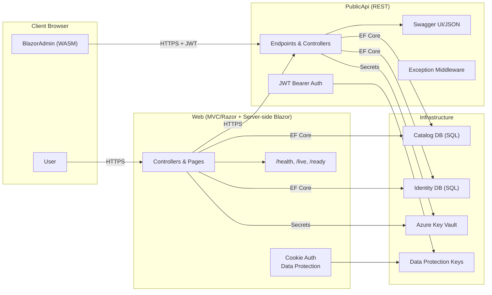

# Threat Model Diagram and Notes

## System Context
The eShopOnWeb solution includes:
- Web (MVC/Razor Pages + Server-side Blazor hosting)
- PublicApi (REST)
- BlazorAdmin (WebAssembly client)
- Infrastructure with EF Core for Catalog and Identity databases
- Health checks and Swagger endpoints
- Optional Azure Key Vault and Azure SQL in production

## Data Flows and Trust Boundaries
- User browser ↔ Web app (HTTPS)
- BlazorAdmin (WASM) ↔ PublicApi (HTTPS) with JWT
- Web ↔ PublicApi (internal, HTTPS)
- Apps ↔ Databases (SQL) over secure connections
- Apps ↔ Azure Key Vault for secrets and keys

## Diagram

## Threats and Controls Overview
- Threat: Token exfiltration (XSS) on client side.
  - Control: Avoid token storage in Local Storage; CSP; sanitize outputs; short token lifetime.
- Threat: Secret leakage from source or container manifests.
  - Control: Key Vault, env vars, remove hardcoded secrets; rotate keys.
- Threat: API enumeration through Swagger.
  - Control: Disable in production or require auth; hide PII.
- Threat: DoS/bruteforce on endpoints.
  - Control: Rate limiting; account lockout; anti-automation.
- Threat: Information disclosure via errors and health outputs.
  - Control: ProblemDetails with generic messages; restrict health endpoints.

## Notes and Assumptions
- Production deployments will have TLS termination and HSTS enabled.
- Data Protection keys are persisted and encrypted in production.
- Admin operations via BlazorAdmin require strict origin CORS and auth.
